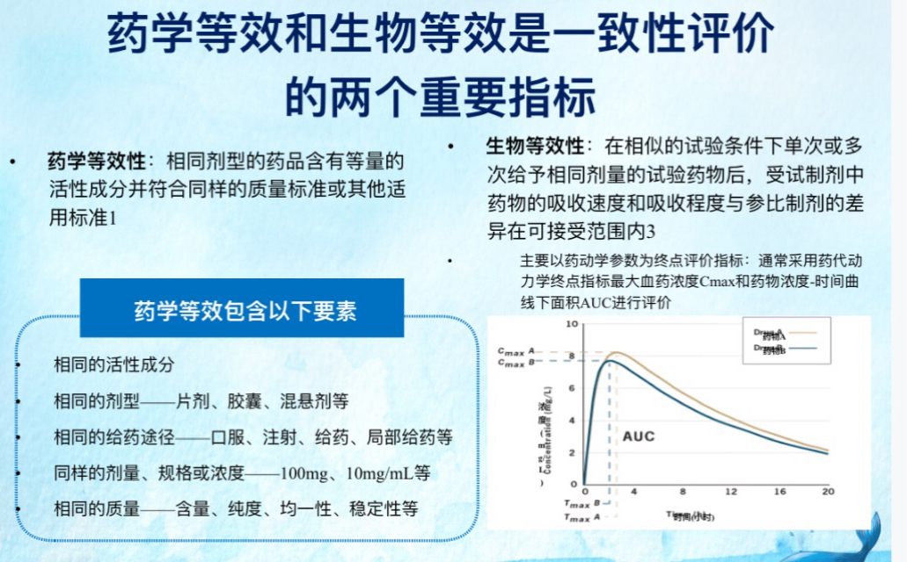
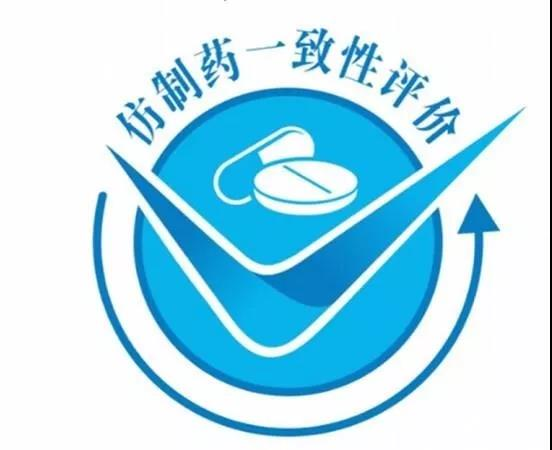

# 什么是通过一致性评价的仿制药？

## 1. 什么是原研药？什么是仿制药？

原研药是首家研发上市的药品，经过专利保护期后，其他企业可以进行仿制。仿制药与原研药具有相同的活性成分、剂型、给药途径和治疗作用。

## 2. 什么是“药品一致性评价”？

仿制药一致性评价是对已批准上市的仿制药进行质量一致性评价，确保其在质量与疗效上达到与原研药一致的水平。这不仅能节约医疗费用，还能提升仿制药质量和制药行业的发展水平，确保公众用药安全有效。

## 3. 药物一致性评价中的“一致”主要分为两个方面

### 3.1 药学等效性

仿制药必须与原研药（参比制剂）具有相同的药物活性成分、剂量、给药途径、剂型，并符合药品质量标准（如活性成分含量、药品纯度、均匀度、崩解时间、溶出速率等）。在非活性成分方面，仿制药不需要与原研药完全一致。

### 3.2 生物等效性

生物等效性验证即 BE 实验，要求仿制药在体内的吸收、代谢情况与原研药一致。通过健康受试者服用仿制药和原研药，定期检测血药浓度，比较两组数据，确保所有数据通过一致性标准后，仿制药才有资格通过生物等效性验证。

两个等效性（药学 + 生物学）均满足后，药品才有资格申请“一致性评价”的批准。

此外，还有各种从研发到生产的要求及药监局的现场检查。例如：相同的适应症。

仿制药与已批准的原研药需具有相同的说明书和标签、使用条件和适应症。

## 相同的质量控制和管理

仿制药的生产须符合药品生产质量规范（GMP 要求）。

通过一致性评价的仿制药与原研药质量和疗效一致，临床上可实现相互替代。仿制药品的包装盒上多了一个下图的图案。

